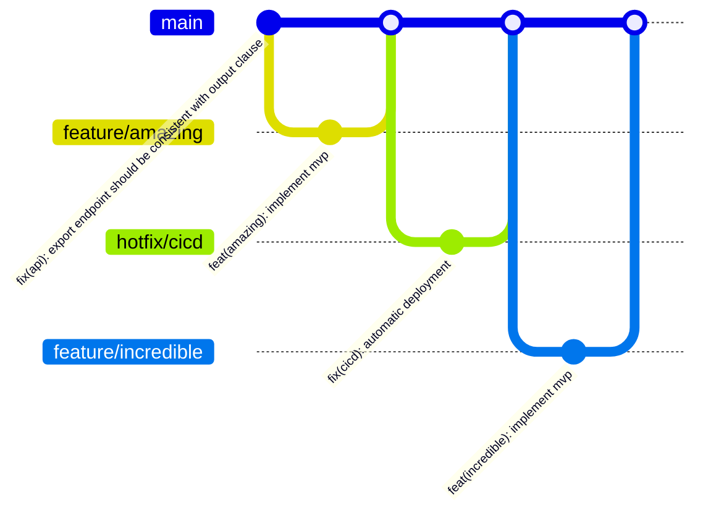

[](http://commitizen.github.io/cz-cli/)
[](https://semantic-release.gitbook.io/semantic-release/)

# scim-patch-dotnet

## About

**ScimPatch** is an open source implementation to facilitate the use of [SCIM V2 patch](https://datatracker.ietf.org/doc/html/rfc7644#section-3.5.2) in .net projects.

With this, from a JsonPatch object, we can apply the list of operations on c# objects.

As described in [RFC7644](https://datatracker.ietf.org/doc/html/rfc7644#section-3.5.2):

> The general form of the SCIM PATCH request is based on JSON Patch [RFC6902](https://datatracker.ietf.org/doc/html/rfc6902).
One difference between SCIM PATCH and JSON Patch is that SCIM servers do not support array indexing and do not support [RFC6902](https://datatracker.ietf.org/doc/html/rfc6902) operation types relating to array element manipulation, such as "move".

## Table of Contents

- [Features](#features)
- [Installation](#installation)
- [Usage](#usage)
- [License](#license)
- [Contributing](#contributing)
- [Contact](#contact)
- [Useful Links](#useful-links)

## Features

- [Enforced Conventional Commits](https://www.conventionalcommits.org/en/v1.0.0/)
- [Enforced Semantic Release](https://semver.org/)

## Installation

Install latest version via package manager:

```
dotnet add package ScimPatch
```

## Usage

For a json with an array of operations:
```json
[
  {
    "op": "add",
    "path": "IntProperty",
    "value": 123
  },
  {
    "op": "remove",
    "path": "NullableBoolProperty"
  }
]
```
We just need to parse to the equivalent OperationNodes:
```csharp
List<bool> results = [];
var operations = OperationTracker.FromJson(targetObject, json);
foreach (var operationNode in operations)
{
    results.Add(await operationNode.TryApplyAsync());
}
```
After that, the targetObject will have all modifications in memory.

You can code your models (target objects) such that it keeks the state of modified properties so you only persist on your storage what is necessary.

For more detailed examples, refer to the samples project at the [repository page](https://github.com/guilhermecamara/scim-patch-dotnet).

## License

This project is licensed under the Apache 2.0.

See [`LICENSE.md`](/LICENSE.md) for more information.

## Contributing

We welcome contributions! Contributions are what make the open source community such an amazing place to learn, inspire, and create. Any contributions you make are **greatly appreciated**.

If you have a suggestion that would make this better, please fork the repo, make changes and create a pull request. You can also simply open an issue with the tag "enhancement". Don't forget to give the project a star! Thanks again!

This GitHub repository adheres to the principles of [GitHub Flow](https://docs.github.com/en/get-started/using-github/github-flow) as outlined in the official GitHub documentation. We ensure that all changes are made through branch-based workflows, enabling collaborative development and efficient code review before integration into the main branch.



1. Fork the Project
1. Create your Feature Branch (`git checkout -b feature/amazing`)
1. Commit your Changes (`npm run commit`)
1. Push to the Branch (`git push origin feature/amazing`)
1. Open a Pull Request

## Contact
If you have any questions or feedback, feel free to reach out:

* Email: guilherme.camara@outlook.com.br

## Useful Links

* Scim V2 Patch: [RFC7644](https://datatracker.ietf.org/doc/html/rfc7644#section-3.5.2)
* Json Patch: [RFC6902](https://datatracker.ietf.org/doc/html/rfc6902)

